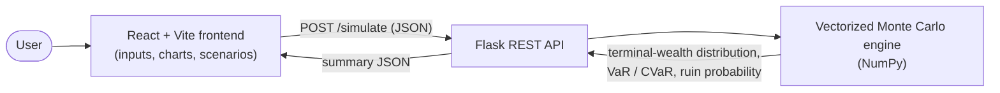

# Monte Carlo Portfolio Simulator

**Correlated multi-asset Monte Carlo simulation of portfolio outcomes — with VaR/CVaR tail risk and ruin probability across the accumulation → decumulation lifecycle.**

A full-stack tool that projects the distribution of a portfolio's terminal wealth by simulating thousands of correlated market paths, then reports the risk metrics a planner actually cares about: where you likely land, how bad the tail gets, and the probability the money runs out in retirement.

> ⚠️ Educational project — not investment advice. It assumes historical return/volatility patterns and excludes taxes, fees, and regime shifts.

- **Live demo:** `<add your deployed frontend URL>`
- **Live API:** https://retirement-sim.onrender.com (`GET /health`, `POST /simulate`)

---

## Architecture



The frontend is a thin client: all financial computation happens server-side in the simulation engine, exposed through a small REST API.

```
monte-carlo-portfolio-simulator/
├── backend/     # Flask API + vectorized Monte Carlo engine (Python, NumPy)
│   └── README.md   # full API reference, parameters, and the math
└── frontend/    # React + TypeScript + Vite UI (mirrored from the design tool)
```

---

## The model

Each simulation advances a portfolio year-by-year through two phases, and the whole fan of scenarios is evolved together as NumPy arrays (the only Python loop is over years, not over the thousands of paths).

- **Correlated multi-asset returns** — stocks, bonds, and cash are drawn from a multivariate normal built from each asset's volatility and the stock/bond correlation, so diversification is modeled rather than assumed away.
- **Lognormal (geometric) growth** — returns compound multiplicatively via `wealth *= exp(log_return)`, matching how markets actually behave, with the drift adjusted (`μ − σ²/2`) so the lognormal mean is right.
- **Stochastic inflation** — sampled each year and used to index retirement spending.
- **Accumulation** — annual contributions that grow with a salary-growth rate.
- **Decumulation (the 4% rule, done properly)** — a fixed *real* withdrawal is set at retirement and indexed to realized inflation each year, floored at zero. This is what makes ruin probability a meaningful number instead of pinned at ~100%.

### Metrics reported

Distribution figures describe the **nest egg at retirement**; durability figures describe the **end of the retirement horizon**.

| Metric | Meaning |
|---|---|
| `median`, `percentile_10/90` | Central and tail outcomes of the retirement balance |
| `var_5` | Value at Risk — the 5th-percentile (worst-5%) retirement balance |
| `cvar_5` | Conditional VaR — expected balance *within* that worst-5% tail |
| `probability_reaching_goal` | P(retirement balance ≥ goal) |
| `survival_probability` | P(money lasts the full horizon) = 1 − probability of ruin |
| `average_max_drawdown` | Average worst peak-to-trough drop over the lifetime |

Full parameter list and endpoint reference: [`backend/README.md`](backend/README.md).

---

## Tech stack

| Layer | Stack |
|---|---|
| **Engine / API** | Python · NumPy · Flask · Gunicorn — deployed on Render |
| **Frontend** | React · TypeScript · Vite · Tailwind · shadcn/ui · Supabase (auth) |

---

## Quickstart

**Backend** (serves on `http://127.0.0.1:5001`):

```bash
cd backend
python3 -m venv venv
./venv/bin/pip install -r requirements.txt
./venv/bin/python app.py
```

Smoke-test it:

```bash
curl -s -X POST http://127.0.0.1:5001/simulate \
  -H "Content-Type: application/json" \
  -d '{"age":25,"retirement_age":65,"savings":10000,"contribution":6000}'
```

**Frontend**:

```bash
cd frontend
npm install
npm run dev
```

---

## Keeping the frontend in sync

The frontend is authored in [Lovable](https://lovable.dev) and lives in its own repo; this monorepo keeps a mirror under `frontend/`. **Edit the UI in Lovable, not here**, then pull the latest snapshot in with a single command:

```bash
# from the monorepo root
scripts/sync-frontend.sh                       # clone the remote (uses your GitHub auth)
# or mirror an existing local clone (no auth needed):
scripts/sync-frontend.sh ../future-wealth-sim
```

Each sync is one commit authored by you, so the integration history stays under your name.

---

## Author

Built by **Israel Adeboga** — exploring quantitative finance, stochastic modeling, and full-stack engineering.
